# Blotter v2 — implementation plan

**Date:** 2026-09-01
**Status:** Draft for review. Not contract. The normative spec lands as design-doc amendment r48 in Phase 0.
**Input:** `blotter-v2-signal-floor-checkpoint-2026-09-01.md` (the checkpoint). This plan turns its 18 decisions into ordered, reviewable batches.

## 1. Where the tree is today

Facts the phases below depend on (verified 2026-09-01):

| Fact | Value |
|---|---|
| Crate / envelope contract | 0.15.0 / `meta.contract` 5 |
| Newest design amendment | r47 (2026-08-31) |
| Auto-capture write lane | retired in r32; read-side `--include-auto` filtering still live in 8 commands |
| `severity` | `enum Severity` in `src/lib.rs:16`; hashed into the cut ID by `compute_id` (`src/lib.rs:350`) |
| `source` field | `Option<String>` on the folded item; set only by the retired hook lane, always `None` from `add` |
| Retrospect candidate types | string literals (`wrapper_alias`, `doc_repair`, `skill_candidate`), no enum |
| Resolution | `struct Resolution` (`src/lib.rs:110`): note/task/pr/commit/url/dropped/amended, no disposition |
| Legacy `pc_` records | r12 promises they fold "forever"; the dogfood log holds zero; `tests/cli/legacy.rs` spends 15 references on them |
| Dogfood log | 165 cuts, 8 dogears, 23 resolves — the polluted history the checkpoint describes |
| Open backlog | TASK-2 (distribution), TASK-71 (is_rare weighting) |
| Specs dir | `docs/superpowers/specs/` absent (normal) |

Two of these change the pacing. The cut ID hashes severity, so the rename is a record-identity change and takes the full orchestrated chain (pre-implementation critique leg, implementer, cross-model diff review, 5x gate). And `source` is dead on the write side already, so replacing it with `origin` costs nothing on the read side.

## 2. Research addendum

The checkpoint's research pass validated the architecture. This pass targeted the four design decisions the spec must settle. Codex ran an independent sweep in parallel; agreements and gaps are noted.

**Admission floor.** Selective retention beats unbounded storage under noise: Reddy's TraceRetain (arXiv 2606.29178, June 2026) holds Precision@5 flat (16.9%→16.6%) where unbounded memory degrades (20.2%→12.4%), and names the failure "memory pollution" — redundant, failed, or generic entries crowding out useful ones. This is the checkpoint's diagnosis in another vocabulary. Ubuntu's One Hundred Papercuts wiki draws the same line the checkpoint draws: a papercut is "not merely a really annoying bug"; it must be one an average user hits on day one and one developer can fix in a day. Transferable and fixable, not just felt. *Direction is consensus across T3 and T1; magnitude is contested* — Wang's MemDelta (arXiv 2606.29914, June 2026) shows memory-system gains flipping sign under a matched retrieval baseline ("Mem0 beats MiniLM-RAG by +11pp but loses to cloud-RAG by 1.2pp"), so no claim in r48 should lean on a measured effect size, only on the policy direction.

**Promotion.** Community Claude Code tooling has converged on the same primitive without naming it: claude-improve promotes a learning into skill/CLAUDE.md/settings after "~5 runs" and audits "whether previously accepted changes actually landed"; recall "proposes skills from recurring patterns". None of them record provenance from the promoted artifact back to the episodes. That gap is the promotion record's reason to exist. *Reported, several independent repos.* The skills paper (Jiang et al., arXiv 2608.14036, Aug 2026) adds two constraints the spec should carry: skills work as "procedural anchors" (65.7% of mechanisms) not knowledge dumps, and skill pools past a few dozen entries lose actual-use precision (29.6%→3.3% from 5 to 100 skills). So `promote` should stay a provenance record for a few durable artifacts, never a generator of many. *Single source, early signal.*

**Dispositions.** Sentry's issue states (docs.sentry.io/product/issues/states-triage) are the closest live analogue: Resolved (any later event is a regression), Archived until-escalating or forever (events still recorded, never flagged), Regressed, Escalating. Map: `fixed`/`promoted` = Resolved with regression detection, `accepted` = Archived forever, `invalid` has no Sentry analogue because Sentry deletes instead. `verify` already implements Regressed; the disposition split gives it the Archived exclusion it lacks. The Codex sweep added the tracker view: Jira, GitHub, and Linear all separate closure meaning from priority (Done / Won't do / Duplicate / Cannot reproduce; COMPLETED / NOT_PLANNED / DUPLICATE), and Bugzilla and Google Issue Tracker go one step further with a VERIFIED state that only QA can set. Blotter's `verify` plays that verifier role after the fact, so `fixed` needs no separate verified sub-state. `duplicate` was considered and left out: triage clusters already carry that relation, and a resolve disposition would duplicate it. *T1, consensus on the split; labels vary by tool.*

**Migration.** Event-store practice (Marten docs, martendb.io/events/versioning) is unanimous: transform on read ("upcasting ... performed on the fly each time the event is read"), keep stored bytes immutable, and no documented one-time rewrite. That is the right answer for a store whose history is an asset. Blotter's v1 history is the exhaust the checkpoint exists to stop collecting, and an upcaster keeps the v1 hash alive forever, which is dead code by another name. The literature informs the shape of the break (immutable old file, explicit boundary), not whether to make it. Recommendation in §3. *T1/T4 consensus on mechanics; the choice is blotter's.*

**Origin seam.** The right anchor is not the GenAI conventions (still provisional, with agent fields already moved or deprecated in the registry) but the Stable OTel Logs Data Model, which defines optional `TraceId`, `SpanId`, and `TraceFlags` on a log record and states "If SpanId is present TraceId SHOULD be also present." W3C Trace Context fixes the widths (32 and 16 hex characters). The `origin` shape should reserve exactly `trace_id`, `span_id`, and `trace_flags` under a provider discriminator, validate the widths when present, and never require them for admission. *T1, consensus.*

**Record versioning.** The sweep's one recommendation this plan had not made: put an in-band version on each record (`v: 2`). JSON Lines has no file header, so a per-record marker is the only version information a file can carry. Adopted: v2 writes it on every record and refuses records without it, so the next break has a boundary to key on. *T1 for the format constraint; the local-file design is an inference both tracks reached independently.*

Sources: arxiv.org/html/2606.29178v1 · arxiv.org/abs/2606.29914 · arxiv.org/html/2608.14036 · wiki.ubuntu.com/One%20Hundred%20Papercuts · github.com/TerenceBristol/claude-improve · github.com/maxdmyers/recall · docs.sentry.io/product/issues/states-triage/ · developers.google.com/issue-tracker/concepts/issues · linear.app/docs/configuring-workflows · martendb.io/events/versioning · docs.axoniq.io/axon-framework-reference/5.1/events/event-versioning/ · jsonlines.org · opentelemetry.io/docs/specs/otel/logs/data-model/ · www.w3.org/TR/trace-context/

Tier coverage: T1 (specs, vendor docs), T3 (three 2026 preprints), T4/T5 thin — community repos stood in for practitioner writing, and no named-author critique of admission policies for agent friction logs was found. Omitted: no source argues against a higher admission floor; the closest counter-evidence is the checkpoint's own cross-session weak-signal caveat.

## 3. Decisions this plan takes

The checkpoint leaves seven open questions for the spec. The plan pre-answers five so Phase 0 starts from a position, and leaves two to Quinn.

1. **Migration: fresh ledger, no upcaster, no migrate command.** Every v2 record carries `v: 2` and v2 reads nothing else. A discovered log whose records lack `v: 2` is a named structured error (a new `error.rs` code, exit 65-class) telling the operator to rename it to a v1 filename and start clean; it is never a silent skip and never a partial fold. The old file stays beside the new one for the 0.15 binary. Nothing rewrites it. Removed outright: the v1 ID hash, the severity→impact map, the `pc_` namespace and r12's "forever" promise, the `source` fold, and `tests/cli/legacy.rs`. The 0.15 history is the exhaust the checkpoint describes, and an upcaster would keep dead code alive to preserve it. *Quinn's call, confirmed 2026-09-01: full break.*
2. **Promotion IDs share the `bl_` namespace.** One ID scheme, one doctor verifier, `kind` disambiguates. The hash covers ts, agent, sources, artifact type, artifact ref.
3. **Promotion and resolution stay separate events.** As the checkpoint recommends. `promote` never writes a resolve; `resolve --disposition promoted` names the friction's fate and may carry `--promotion <id>` as a link, validated to exist (exit 66 otherwise).
4. **Patterns are not persisted.** Retrospect stays a derived view.
5. **Dogear promotion is out of v2 scope.** Sources of a promotion are cuts only; dogears keep `--url` and `--dropped`. Revisit with evidence.

Left to Quinn:

- **Crate version.** 1.0.0 (v2 model = first stable contract) or 0.16.0. This plan assumes 1.0.0 and `meta.contract` 6.
- **Accepted friction in triage and digest.** Checkpoint says probably visible in historical views. Plan assumes: `accepted` cuts are resolved, so they leave open-cut views as today; `verify` never anchors on them; `digest` gains no new section.

## 4. Phases

Each phase is one PR. Phases 2 through 5 touch persistence or record identity and cannot merge direct. Dependencies are listed; anything not dependent runs in parallel. Every worker gets its own worktree, the standing brief clauses (status contract, destructive floor, no improvising on ambiguity, report bound), and the four-command gate. Phases that touch `src/store.rs` or the fold also run `scripts/dev/gate-5x.sh`.

### Phase 0 — Normative v2 spec (amendment r48)

Depends on: this plan approved.
Deliverable: one amendment to `docs/plans/2026-07-09-papercuts-design.md` covering admission policy, `impact`, the cut/dogear/promotion ontology, dispositions and their recurrence behaviour, the promotion record and artifact vocabulary, `origin`, the `auto` deletion, retrospect's pattern/intervention split, the upcast rule, and contract 6. Every later phase quotes r48, not the checkpoint.
Routing: design-judge-opus-med drafts against the checkpoint plus §3; I integrate; one Codex read-only review of the amendment text (cross-model, r3 precedent). Full chain, because it touches identity and several interacting rules.
Gate: `cargo test docs` (repo-layout gates) still passes; no code.

### Phase 1 — Policy before mechanism (docs + copy)

Depends on: nothing. Runs alongside Phase 0.
Change: rewrite the admission guidance where agents actually read it: `AGENTS.md` Dogfood section, `README.md` "what is a cut" copy, and the `add --help` severity string (`src/cli.rs`, `src/commands/schema.rs`). The repo ships no agent skill file, so those three are the whole surface. Replace "log every friction, default minor" with the five admission tests and the skip list from checkpoint §5–6. Keep `severity` vocabulary in this phase; the rename lands in Phase 3.
Why first: the checkpoint's own conclusion is that the signal problem is "largely explained by instructions that explicitly encourage trivial filing". This is the cheapest lever and it needs no contract change.
Routing: I write it (taste-critical copy). Small PR, direct merge allowed.
Gate: four commands; `schema_documents_*` tests updated.

### Phase 2 — Delete the `auto` lane

Depends on: nothing contractual (r32 already retired the write side). Merge after Phase 0 so the contract bump is spec'd.
Change: remove `is_auto_capture` and the partition helper (`src/lib.rs:210–223`), `--include-auto` from list/triage/digest/verify/sweep/export and its schema entries, the "N auto-captured records hidden" warning, retrospect's include-by-default special case, `src/commands/hook.rs` and the `hook` subcommand, `tests/cli/hook.rs`, `tests/cli/auto_capture.rs` (700 lines), the `hook` and `auto_capture` module declarations in `tests/cli/main.rs`, and the AGENTS.md invariant bullet. `auto` becomes a plain tag. Archive `docs/archive/2026-08-09-auto-capture-default-hidden-design.md` stays as is.
Contract: 5 → 6 (default reads change for any log holding `auto` records; `hook` subcommand removed).
Routing: Codex terra @ max in its own worktree. Passes the Luna test on verifiability but fails it on blast radius (8 command files, one test-module deletion), so terra. Cross-model review: my own diff read plus tests; a Codex diff over 200 lines in a default-read domain gets one pr-reviewer-high pass.
Gate: four commands; `every_test_module_file_is_declared_in_main` passes after the module removals.

### Phase 3 — Record model break

Depends on: Phase 0 (r48), Phase 2 (so `auto` is gone before the fold changes).
Change, in one PR because they share the fold and the ID hash:
- `severity` → `impact` with `low|material|blocking`: enum, `--impact` flag (`--severity` removed, not aliased), envelope field, list sort, export's OTLP severity map, digest/triage rendering, README/schema copy.
- Every record carries `v: 2`; the scanner rejects a log holding records without it with the named error from decision 1; `compute_id` hashes `impact`; the v1 hash path, the `pc_` namespace, and `IdNamespace` go.
- `origin` replaces `source`: `{type: "agent"}` written by `add`; optional `provider`, `trace_id`, `span_id`, `trace_flags` accepted, width-validated, and stored, but never set by any command.
- Resolution gains `disposition: fixed|promoted|accepted|invalid` via `resolve --disposition`, required for cuts, rejected for dogears; `--amend` may change it.
- `tests/cli/legacy.rs` is deleted; the v1-file-refused case and the mixed-file case move to `contract.rs`.
Routing: full chain. implementer-opus-med in a worktree (silent-failure domain: persistence, identity); pr-reviewer-xhigh on the diff plus `codex review` for the cross-model axis. `gate-5x.sh` required. A pre-implementation critique of the r48 identity rules happens in Phase 0, not here.
Tests: `contract.rs` for the exit matrix, envelope shape, and the v1-file refusal; `doctor.rs` for how a v1 line is reported.

### Phase 4 — `promotion` record and `promote` command

Depends on: Phase 3.
Change: new record kind `promotion` (`id`, `ts`, `agent`, `sources[]`, `artifact{type,ref}`, `note?`), artifact types `doc|skill|guard|test|tool|process`; `blotter promote --source <id>... --artifact-type X --artifact-ref R [--note]`; mutation runs read→fold→validate every source is a cut (66 if missing, `invalid_argument` if a dogear)→append under the exclusive lock, same shape as `add`. `list --kind promotion|all` shows them; `list --kind cut` default is untouched. `resolve --disposition promoted --promotion <id>` links to an existing promotion. `doctor` learns the kind. `schema` publishes it.
Routing: implementer-opus-med (new mutation path, lock discipline). pr-reviewer-high on the diff. `gate-5x.sh`.
Tests: new module `tests/cli/promote.rs`, declared in `main.rs`.

### Phase 5 — Analysis semantics

Depends on: Phase 3 and 4.
Change:
- `verify`: anchors are resolved cuts with disposition `fixed` or `promoted` only; `accepted` and `invalid` are excluded and named in `schema`. Envelope adds `disposition` to `resolution{}`.
- `retrospect`: candidate `type` becomes `pattern` from `recurrent_friction|failed_intervention|repeated_recovery|documentation_gap`, plus `suggested: [doc|skill|guard|...]`. Same clustering and recurrence rules; `wrapper_alias` and `doc_repair` become suggestions on a `recurrent_friction` pattern; `skill_candidate` becomes `failed_intervention` with suggestion `skill`. Deterministic, no window, same exit codes.
- `triage`/`digest`: vocabulary only (impact), unless Quinn's open decision on `accepted` adds a digest section.
Routing: implementer-opus-med (retrospect's typing is judgment-adjacent). One pr-reviewer-high pass. No store.rs touch, so single gate run.

### Phase 6 — Release 1.0.0

Depends on: everything above merged.
Change: CHANGELOG (each phase adds its entry in its own PR; this phase only cuts the version header), `Cargo.toml` version, `scripts/dev/check-msrv.sh` run on 1.89.0, archive the checkpoint doc to `docs/archive/` with an archived date, update `docs/superpowers/specs/` if any spec was written (none planned; r48 is the spec), README quickstart re-recorded against the new envelope.
Routing: luna @ max for the mechanical sync (CHANGELOG header, version, MSRV run), me for the README read-through. Direct merge as docs housekeeping is not allowed here: the version bump ships, so it is a PR.

## 5. Sequence

```mermaid
gantt
    dateFormat  X
    axisFormat  %s
    section Spec & policy
    P0 r48 spec (full chain)      :p0, 0, 3
    P1 policy copy PR             :p1, 0, 2
    section Delete
    P2 auto lane removal (Codex)  :p2, 1, 3
    section Break
    P3 record model (full chain)  :p3, 3, 6
    P4 promotion record           :p4, 6, 8
    P5 analysis semantics         :p5, 8, 10
    section Ship
    P6 release 1.0.0              :p6, 10, 11
```

Units are review checkpoints, not days. P1 and P2 overlap P0; P2's implementer starts against the draft amendment and receives corrections warm. P3 is the serial bottleneck and the only phase with a pre-implementation critique leg.

## 6. Backlog tasks to create

Created only after this plan is approved, with `backlog task create`, one per phase, parented where a phase splits:

- TASK-72 v2 spec: design-doc amendment r48
- TASK-73 Admission policy copy: AGENTS.md, README, `add --help`
- TASK-74 Delete the auto lane and `hook` subcommand (contract 6)
- TASK-75 severity → impact, structured origin, resolution disposition (record model break)
- TASK-76 `promotion` record and `blotter promote`
- TASK-77 verify/retrospect disposition and pattern semantics
- TASK-78 Release 1.0.0

## 7. Risks and how the plan handles them

- **Silent v1 read.** A v2 binary pointed at a 0.15 log must fail loudly, not fold a subset. Handled by the scanner-level refusal in Phase 3 and a mixed-file test in `contract.rs`.
- **Lost dogfood history.** 165 cuts and 23 resolves stop being readable by the new binary. Accepted: the old file stays on disk, the 0.15 binary still reads it, and the history is the noise the floor is being raised against.
- **Reviewer fatigue on Phase 3.** The largest diff and the only one where a silent bug corrupts every later fold. Full chain, 5x gate, and the identity rules critiqued before code exists.
- **Scope creep into workflow management.** `promote` records provenance and nothing else. Any brief that asks a worker to touch the artifact it points at is out of scope by construction.
- **Policy copy that still invites exhaust.** Phase 1 is reviewed by Quinn line by line, not by a worker.
- **Cross-session weak signals lost by the higher floor.** Accepted and deferred by the checkpoint; the `origin` seam is the only provision.

## 8. What this plan does not do

No importance scores, no LLM admission classifier, no raw event kind, no telemetry ingestion, no promotion plugin framework, no dogear promotion. Each is listed in checkpoint §13 and stays out.
