# Blotter v2 — implementation plan

**Date:** 2026-09-01
**Status:** Reworked 2026-09-01 after a Codex sol review (§9); amended the same day by r49 after the progress review (§10) and by r50 after the Phase 3 pre-implementation critique (§11). Not contract. The normative spec is design-doc amendment r48 as corrected by r49 and r50.
**Input:** `blotter-v2-signal-floor-checkpoint-2026-09-01.md` (the checkpoint). This plan turns its 18 decisions into ordered, reviewable batches.

## 1. Where the tree is today

Facts the phases below depend on (verified 2026-09-01):

| Fact | Value |
|---|---|
| Crate / envelope contract | 0.15.0 / `meta.contract` 5 |
| Newest design amendment | r47 (2026-08-31) |
| Auto-capture write lane | retired in r32; read-side `--include-auto` filtering still live in 6 commands (list, triage, digest, verify, sweep, export); retrospect includes by default |
| `severity` | `enum Severity` in `src/lib.rs:16`; hashed into the cut ID by `compute_id` (`src/lib.rs:350`) |
| `source` field | `Option<String>` on the folded item; set only by the retired hook lane, always `None` from `add` |
| Retrospect candidate types | string literals (`wrapper_alias`, `doc_repair`, `skill_candidate`), no enum |
| Resolution | `struct Resolution` (`src/lib.rs:110`): note/task/pr/commit/url/dropped/amended, no disposition |
| Legacy `pc_` records | r12 promises they fold "forever"; the dogfood log holds zero; `tests/cli/legacy.rs` spends 17 references on them, and its first three tests cover `source` provenance, not `pc_` |
| Dogfood log | 166 cuts, 8 dogears, 23 resolves — the polluted history the checkpoint describes |
| Open backlog | TASK-2 (distribution), TASK-71 (is_rare weighting); TASK-72..78 created 2026-09-01 for the phases below |
| Specs dir | `docs/superpowers/specs/` absent (normal) |

Two of these change the pacing. The cut ID hashes severity, so the rename is a record-identity change and takes the full orchestrated chain (pre-implementation critique leg, implementer, cross-model diff review, 5x gate). `source` is dead on the write side, but not on the read side: it is materialized into list items and into triage, digest and verify output, and `tests/cli/legacy.rs` carries the propagation tests. Replacing it with `origin` is a port, not a delete.

## 2. Research addendum

The checkpoint's research pass validated the architecture. This pass targeted the four design decisions the spec must settle. Codex ran an independent sweep in parallel; agreements and gaps are noted.

**Admission floor.** Selective retention beats unbounded storage under noise: Reddy's TraceRetain (arXiv 2606.29178, June 2026) holds Precision@5 flat (16.9%→16.6%) where unbounded memory degrades (20.2%→12.4%), and names the failure "memory pollution" — redundant, failed, or generic entries crowding out useful ones. This is the checkpoint's diagnosis in another vocabulary. Ubuntu's One Hundred Papercuts wiki draws the same line the checkpoint draws: a papercut is "not merely a really annoying bug"; it must be one an average user hits on day one and one developer can fix in a day. Transferable and fixable, not just felt. *Direction is consensus across T3 and T1; magnitude is contested* — Wang's MemDelta (arXiv 2606.29914, June 2026) shows memory-system gains flipping sign under a matched retrieval baseline ("Mem0 beats MiniLM-RAG by +11pp but loses to cloud-RAG by 1.2pp"), so no claim in r48 should lean on a measured effect size, only on the policy direction.

**Promotion.** Community Claude Code tooling has converged on the same primitive without naming it: claude-improve promotes a learning into skill/CLAUDE.md/settings after "~5 runs" and audits "whether previously accepted changes actually landed"; recall "proposes skills from recurring patterns". None of them record provenance from the promoted artifact back to the episodes. That gap is the promotion record's reason to exist. *Reported, several independent repos.* The skills paper (Jiang et al., arXiv 2608.14036, Aug 2026) adds two constraints the spec should carry: skills work as "procedural anchors" (65.7% of mechanisms) not knowledge dumps, and skill pools past a few dozen entries lose actual-use precision (29.6%→3.3% from 5 to 100 skills). So `promote` should stay a provenance record for a few durable artifacts, never a generator of many. *Single source, early signal.*

**Dispositions.** Sentry's issue states (docs.sentry.io/product/issues/states-triage) are the closest live analogue: Resolved (any later event is a regression), Archived until-escalating or forever (events still recorded, never flagged), Regressed, Escalating. Map: `fixed`/`promoted` = Resolved with regression detection, `accepted` = Archived forever, `invalid` has no Sentry analogue because Sentry deletes instead. `verify` already implements Regressed; the disposition split gives it the Archived exclusion it lacks. The Codex sweep added the tracker view: Jira, GitHub, and Linear all separate closure meaning from priority (Done / Won't do / Duplicate / Cannot reproduce; COMPLETED / NOT_PLANNED / DUPLICATE), and Bugzilla and Google Issue Tracker go one step further with a VERIFIED state that only QA can set. Blotter's `verify` plays that verifier role after the fact, so `fixed` needs no separate verified sub-state. `duplicate` was considered and left out: triage clusters already carry that relation, and a resolve disposition would duplicate it. *T1, consensus on the split; labels vary by tool.*

**Migration.** Event-store practice (Marten docs, martendb.io/events/versioning) is unanimous: transform on read ("upcasting ... performed on the fly each time the event is read"), keep stored bytes immutable, and no documented one-time rewrite. That is the right answer for a store whose history is an asset. Blotter's v1 history is the exhaust the checkpoint exists to stop collecting, and an upcaster keeps the v1 hash alive forever, which is dead code by another name. The literature informs the shape of the break (immutable old file, explicit boundary), not whether to make it. Recommendation in §3. *T1/T4 consensus on mechanics; the choice is blotter's.*

**Origin seam.** The right anchor is not the GenAI conventions (still provisional, with agent fields already moved or deprecated in the registry) but the Stable OTel Logs Data Model, which defines optional `TraceId`, `SpanId`, and `TraceFlags` on a log record and states "If SpanId is present TraceId SHOULD be also present." W3C Trace Context fixes the widths (32 and 16 hex characters). The `origin` shape should reserve exactly `trace_id`, `span_id`, and `trace_flags` under a provider discriminator, validate the widths when present, and never require them for admission. *T1, consensus.* **Withdrawn by r49 (§10):** the widths and names are stable, but reserving them bought nothing, because optional members added to an optional object later are additive; `origin` keeps `type`, `provider?`, and `ref?` only.

**Record versioning.** The sweep's one recommendation this plan had not made: put an in-band version on each record (`v: 2`). JSON Lines has no file header, so a per-record marker is the only version information a file can carry. Adopted: v2 writes it on every record and refuses records without it, so the next break has a boundary to key on. *T1 for the format constraint; the local-file design is an inference both tracks reached independently.*

Sources: arxiv.org/html/2606.29178v1 · arxiv.org/abs/2606.29914 · arxiv.org/html/2608.14036 · wiki.ubuntu.com/One%20Hundred%20Papercuts · github.com/TerenceBristol/claude-improve · github.com/maxdmyers/recall · docs.sentry.io/product/issues/states-triage/ · developers.google.com/issue-tracker/concepts/issues · linear.app/docs/configuring-workflows · martendb.io/events/versioning · docs.axoniq.io/axon-framework-reference/5.1/events/event-versioning/ · jsonlines.org · opentelemetry.io/docs/specs/otel/logs/data-model/ · www.w3.org/TR/trace-context/

Tier coverage: T1 (specs, vendor docs), T3 (three 2026 preprints), T4/T5 thin — community repos stood in for practitioner writing, and no named-author critique of admission policies for agent friction logs was found. Omitted: no source argues against a higher admission floor; the closest counter-evidence is the checkpoint's own cross-session weak-signal caveat.

## 3. Decisions this plan takes

The checkpoint leaves seven open questions for the spec. The plan pre-answers five so Phase 0 starts from a position, and leaves two to Quinn.

1. **Migration: fresh ledger, no upcaster, no migrate command.** Every v2 record carries `v: 2` and v2 reads nothing else. A discovered log whose records lack `v: 2` is a named structured error (a new `error.rs` code, exit 65-class) telling the operator to rename it to a v1 filename and start clean; it is never a silent skip and never a partial fold. The old file stays beside the new one for the 0.15 binary. Nothing rewrites it. Removed outright: the v1 ID hash, the severity→impact map, the `pc_` namespace and r12's "forever" promise, the `source` fold, and `tests/cli/legacy.rs`. The 0.15 history is the exhaust the checkpoint describes, and an upcaster would keep dead code alive to preserve it. *Quinn's call, confirmed 2026-09-01: full break.*
2. **Promotion IDs share the `bl_` namespace.** One ID scheme, one doctor verifier, `kind` disambiguates. The hash covers ts, agent, sources, artifact type, artifact ref.
3. **Promotion and resolution stay separate events.** As the checkpoint recommends. `promote` never writes a resolve; `resolve --disposition promoted` names the friction's fate and may carry `--promotion <id>` as a link, validated to exist (exit 66 otherwise).
4. **Patterns are not persisted.** Retrospect stays a derived view.
5. **Dogear promotion is out of v2 scope.** Sources of a promotion are cuts only; dogears keep `--url` and `--dropped`. Revisit with evidence.

Decided 2026-09-01:

- **Crate version: 1.0.0**, `meta.contract` 6. Quinn's call: the v2 model is the first stable contract.
- **Accepted friction in triage and digest.** `accepted` cuts are resolved, so they leave open-cut views as any resolved cut does, and `verify` never anchors on them. `digest` gains no section and no listing, only one count field, `accepted_cuts` (named `accepted` until r49), for cuts accepted in the period. Reason: `accepted` is the one disposition that hides friction on purpose, and a count keeps the hide rate visible for near-zero code. Left to my judgment by Quinn. The period is judged by `disposition_ts` — when the acceptance was decided — not by the cut's `ts` and not by the winning resolution's `ts`, which a note-only amend moves (rule stated in r48; this sentence originally said "the winning resolution's timestamp" and was corrected with r49). Shape `{count}`, matching `new_cuts` and `open_dogears` (r49).

Decided in the 2026-09-01 review rework (§9), each a rule r48 must state:

- **One contract bump, one merge to main.** Phases 2 through 5 stack on an integration branch `v2`, each as its own reviewed PR into that branch. `meta.contract` becomes 6 in Phase 2 on that branch and `v2` merges to `main` once, with Phase 6. Consumers never see an intermediate 6.
- **The v1 refusal is a pre-fold, in-lock version probe.** Before any fold, on every path that opens a log for read or write, the probe reads the file under the lock and refuses it with one named non-retryable error (proposed `unsupported_log_version`, exit 65) if any parseable record of a **known** kind lacks `v: 2` or carries another value; unknown kinds and malformed lines never trigger it (r48's rule; this sentence originally omitted the known-kind qualifier). It appends nothing, tear-heals nothing, creates no backup, and no partial fold escapes. An empty file is a fresh v2 log. Malformed lines stay malformed findings and do not by themselves trigger the refusal. `doctor` reports the file as one non-fixable `unsupported_version` finding and `--fix` refuses to touch it; `archive` refuses the same way; `sweep` names the log in its per-log error list and keeps exit 0, as it does for every per-log failure today, so one v1 log does not abort a multi-log sweep.
- **Identity framing.** r48 states the exact hash input for each kind: domain literal `bl2` (cuts and dogears both move off `bl1`), field order, framing, digest width, sorted-unique tags, and sorted-unique sources for promotions. `v` and `origin` are excluded from every hash: `v` is format, `origin` is provenance, and neither changes what the friction is (same reasoning r34 used to keep evidence out).
- **Promotion in `list`.** A promotion has no status and no resolution. `list --kind promotion` shows promotions only; `--kind all` shows cuts, dogears and promotions; the default stays cut-only. Output is a tagged union with a `PromotionItem` shape, ordered newest first then by id, rendered in JSON and `--format md`. The `--kind` enum splits so `sweep` does not grow a `promotion` value; sweep stays cut/dogear.
- **Promotions pin their sources.** `archive` never removes a resolved cut that any promotion names in `sources[]`; provenance is the reason the record exists. `doctor` validates every `sources[]` id resolves to a cut and reports a dangling one as a non-fixable finding.
- **Promotion text fields are authored text.** `artifact.ref` and `note` are redacted per r34 before hashing and before append, with the same length bounds as cut text.
- **Amend and disposition.** On `resolve --amend`, `--disposition` is optional and inherited from the winning resolution when omitted; `--promotion` is kept while the disposition stays `promoted` and cleared when an amend moves the disposition elsewhere. A mixed cut/dogear batch is rejected before any append, as `--url`/`--dropped` already are.
- **Retrospect ships two patterns, not four.** `recurrent_friction` and `failed_intervention` have deterministic sources today. `repeated_recovery` and `documentation_gap` have none, so they are not in the v2 vocabulary; the checkpoint called them potential. Add one when an emission rule exists.
- **The hook receiver goes, and r32's fail-open promise goes with it.** r48 supersedes r32 explicitly. An installed `hook exec claude-code` on 1.0.0 exits 2 with a clap error, so the CHANGELOG and README carry a mandatory upgrade step: remove the hook entry from Claude Code settings before upgrading. Keeping a no-op receiver in a release whose purpose is to remove dead code was rejected.

## 4. Phases

Each phase is one PR. Phases 2 through 5 touch persistence or record identity and cannot merge direct. Dependencies are listed; anything not dependent runs in parallel. Every worker gets its own worktree, the standing brief clauses (status contract, destructive floor, no improvising on ambiguity, report bound), and the four-command gate. Phases that touch `src/store.rs` or the fold also run `scripts/dev/gate-5x.sh`.

### Phase 0 — Normative v2 spec (amendment r48)

Depends on: this plan approved.
Deliverable: one amendment to `docs/plans/2026-07-09-papercuts-design.md` covering admission policy, `impact`, the cut/dogear/promotion ontology, dispositions and their recurrence behaviour, the promotion record and artifact vocabulary, `origin`, the `auto` deletion and the r32 supersession, retrospect's pattern/intervention split, the v1-file refusal rule as a pre-fold in-lock probe with its `doctor`/`archive`/`sweep` behaviour, the exact identity framing per kind, promotion's list shape, source pinning and redaction, the amend rules for disposition, and contract 6. Every rule in §3 is restated as contract text. Every later phase quotes r48, not the checkpoint.
Routing: design-judge-opus-med drafts against the checkpoint plus §3; I integrate; one Codex read-only review of the amendment text (cross-model, r3 precedent). Full chain, because it touches identity and several interacting rules.
Gate: `cargo test docs` (repo-layout gates) still passes; no code.

### Phase 1 — Policy before mechanism (docs + copy)

Depends on: nothing. Runs alongside Phase 0 and lands before Phase 2 starts: both touch `src/cli.rs`, `src/commands/schema.rs`, `README.md` and `AGENTS.md`, and the review found no safe way to run them in parallel worktrees.
Change: rewrite the admission guidance where agents actually read it: `AGENTS.md` Dogfood section, `README.md` "what is a cut" copy, and the `add --help` severity string (`src/cli.rs`, `src/commands/schema.rs`). The repo ships no agent skill file, so those three are the whole surface. Replace "log every friction, default minor" with the five admission tests and the skip list from checkpoint §5–6. Keep `severity` vocabulary in this phase; the rename lands in Phase 3. The README auto/hook sections belong to Phase 2 and are not touched here.
Why first: the checkpoint's own conclusion is that the signal problem is "largely explained by instructions that explicitly encourage trivial filing". This is the cheapest lever and it needs no contract change.
Routing: I write it (taste-critical copy). Small PR, direct merge allowed.
Gate: four commands; `schema_documents_*` tests updated.

### Phase 2 — Delete the `auto` lane

Depends on: Phase 1 merged (shared files), Phase 0 drafted (the contract bump and the r32 supersession are spec'd). First PR into the `v2` integration branch.
Change: remove `is_auto_capture` and the partition helper (`src/lib.rs:210–223`), `--include-auto` from list/triage/digest/verify/sweep/export and its schema entries, the "N auto-captured records hidden" warning, retrospect's include-by-default special case, `src/commands/hook.rs` and the `hook` subcommand, `tests/cli/hook.rs`, `tests/cli/auto_capture.rs` (700 lines), the `hook` and `auto_capture` module declarations in `tests/cli/main.rs`, the AGENTS.md invariant bullet, the hook fast path in `src/main.rs` (`is_hook_exec`), the hook types and dispatch in `src/cli.rs` and `src/commands/mod.rs`, the schema and env entries for hook, the no-op hook assertion in `tests/cli/contract.rs`, the stale include-auto guidance in `src/commands/resolve.rs` and its assertion in `tests/cli/resolve.rs`, and the README auto/hook sections (the read-command paragraph and the Hooks section). `auto` becomes a plain tag. Archive `docs/archive/2026-08-09-auto-capture-default-hidden-design.md` stays as is.
Contract: 5 → 6 on the `v2` branch (default reads change for any log holding `auto` records; `hook` subcommand removed; r32 fail-open superseded, with the upgrade step in CHANGELOG).
Routing: Codex terra @ max in its own worktree. Passes the Luna test on verifiability but fails it on blast radius (8 command files, one test-module deletion), so terra. Cross-model review: my own diff read plus tests; a Codex diff over 200 lines in a default-read domain gets one pr-reviewer-high pass.
Gate: four commands; `every_test_module_file_is_declared_in_main` passes after the module removals.

### Phase 3 — Record model break

Depends on: Phase 0 (r48), Phase 2 (so `auto` is gone before the fold changes). PR into `v2`.
Change, in one PR because they share the fold and the ID hash:
- `severity` → `impact` with `low|material|blocking`: enum, `--impact` flag (`--severity` removed, not aliased), envelope field, list sort, export's OTLP severity map, digest/triage rendering, README/schema copy.
- Every record carries `v: 2`; the pre-fold in-lock probe from §3 refuses a log holding records without it, on every open path (`add`, `dogear`, `resolve`, every read command, `doctor`, `archive`, `sweep` per log); `compute_id` hashes `impact` under the `bl2` framing r48 states; the v1 hash path, the `pc_` namespace, and `IdNamespace` go, including their uses in `src/commands/archive.rs`.
- `origin` replaces `source`: `{type: "agent"}` written by `add` and `dogear` (and by `promote` in Phase 4); optional opaque strings `provider` and `ref` are accepted and stored but never set by any command, with no validation beyond the shape (r49). `origin` is carried wherever `source` is carried today: list items, triage, digest and verify output.
- Resolution gains `disposition: fixed|promoted|accepted|invalid` and `disposition_ts` via `resolve --disposition`, required for cuts, rejected for dogears; `--amend` may change it and otherwise copies both from the pre-append winner (r50). The fold discards invalid resolve events before choosing winners and warns `skipped N invalid resolutions`; `doctor` reports `invalid_resolution` for r48 rules (1)–(3). The stored `promotion` field, `--promotion`, and rules (4)–(6) are Phase 4 (r50).
- `v` is written first on every stored line and appears in no envelope, `add`/`dogear` `data.record` included; the probe keys on the raw `kind` of each scanned line, with its own four-name kind list, and accepts only the JSON integer 2 (r50).
- `tests/cli/legacy.rs` is deleted. Its three `source` provenance tests are ported to a new `tests/cli/origin.rs` (declared in `main.rs`) against the structured field; only the `pc_` tests die. The v1-file-refused case and the mixed-file case go to `contract.rs`; the `doctor --fix` and `archive` refusals go to `doctor.rs` and `archive.rs`. The refusal surface r49 names as product surface — code and exit, `details.file`/`line`, `found_version` present for a wrong `v` and absent for a missing one, `suggested_fix` naming the path with no literal `mv`, byte-identity after every mutating path, `doctor`'s single finding, `sweep`'s deterministic warning — is each a test, not README prose.
- Repo tooling moves with the model: `scripts/dev/generate-scale-fixtures.py` (emits `bl1`, `severity`, no `v`), `scripts/dev/bench-baseline.sh` (`--severity`, disposition-less resolve), and `tests/fixtures/export-otlp-json-golden.jsonl` (0.15.0, severity attributes).
Routing: full chain. implementer-opus-med in a worktree (silent-failure domain: persistence, identity); pr-reviewer-xhigh on the diff plus `codex review` for the cross-model axis. `gate-5x.sh` required. The pre-implementation critique ran 2026-09-01 (§11) and landed as r50 before the implementer was briefed.
Tests: `contract.rs` for the exit matrix, envelope shape, and the v1-file refusal with a byte-identical file afterwards; `doctor.rs` for the non-fixable `unsupported_version` finding and the `--fix` refusal; `store.rs` for no tear-heal on a refused file.

### Phase 4 — `promotion` record and `promote` command

Depends on: Phase 3. PR into `v2`.
Change: new record kind `promotion` (`id`, `ts`, `agent`, `sources[]`, `artifact{type,ref}`, `note?`, `origin` as `{type:"agent"}`, `cwd`), artifact types `doc|skill|guard|test|tool|process`; `blotter promote --source <id>... --artifact-type X --artifact-ref R [--note]`; mutation runs read→fold→validate every source is a cut (66 if missing, `invalid_argument` if a dogear)→append under the exclusive lock, same shape as `add`. `list --kind promotion|all` shows them as `PromotionItem` in the union from §3; `list --kind cut` default is untouched; the `--kind` enum splits so `sweep` stays cut/dogear. `artifact.ref` and `note` are redacted before hash and append. `archive` pins any cut a promotion names. `resolve --disposition promoted --promotion <id>` links to an existing promotion, adding the stored `promotion` field and r48 invalid-resolution rules (4)–(6) to the fold and `doctor` (r50). `doctor` learns the kind and validates `sources[]`. `schema` publishes it.
Routing: implementer-opus-med (new mutation path, lock discipline). pr-reviewer-high on the diff. `gate-5x.sh`.
Tests: new module `tests/cli/promote.rs`, declared in `main.rs`; an archive-pinning case in `archive.rs`; a redaction case in `redaction.rs`.

### Phase 5 — Analysis semantics

Depends on: Phase 3 and 4. Last PR into `v2`.
Change:
- `verify`: anchors are resolved cuts with disposition `fixed` or `promoted` only; `accepted` and `invalid` are excluded and named in `schema`. Envelope adds `disposition` to `resolution{}`.
- `retrospect`: candidate `type` becomes `pattern` from `recurrent_friction|failed_intervention`, plus `suggested: [doc|skill|guard|tool|test|process]`. Same clustering and recurrence rules; `wrapper_alias` and `doc_repair` become suggestions on a `recurrent_friction` pattern; `skill_candidate` becomes `failed_intervention` with suggestion `skill`. Deterministic, no window, same exit codes.
- `triage`: vocabulary only (impact). `digest`: vocabulary plus one `accepted_cuts` count field (cuts whose winning resolution is `accepted` and falls in the period; named by r49); no section, no listing. This is the first place digest walks resolved items, so the window rule is stated in r48.
Routing: implementer-opus-med (retrospect's typing is judgment-adjacent). One pr-reviewer-high pass. No store.rs touch, so single gate run.

### Phase 6 — Release 1.0.0

Depends on: Phases 2 through 5 merged into `v2`. This PR is `v2` → `main`, the one merge consumers see.
Change: CHANGELOG (with the mandatory hook-removal upgrade step) (each phase adds its entry in its own PR; this phase only cuts the version header), `Cargo.toml` and `Cargo.lock` version, `scripts/dev/check-msrv.sh` run on 1.89.0, archive the checkpoint doc to `docs/archive/` with an archived date, update `docs/superpowers/specs/` if any spec was written (none planned; r48 is the spec), README quickstart re-recorded against the new envelope.
Routing: luna @ max for the mechanical sync (CHANGELOG header, version, MSRV run), me for the README read-through. Direct merge as docs housekeeping is not allowed here: the version bump ships, so it is a PR.

## 5. Sequence

```mermaid
gantt
    dateFormat  X
    axisFormat  %s
    section Spec & policy
    P0 r48 spec (full chain)      :p0, 0, 3
    P1 policy copy PR             :p1, 0, 1
    section Delete (into v2)
    P2 auto lane removal (Codex)  :p2, 1, 3
    section Break (into v2)
    P3 record model (full chain)  :p3, 3, 6
    P4 promotion record           :p4, 6, 8
    P5 analysis semantics         :p5, 8, 10
    section Ship (v2 to main)
    P6 release 1.0.0              :p6, 10, 11
```

Units are review checkpoints, not days. P1 overlaps P0 and lands first; P2 starts after P1 merges and works against the draft amendment, receiving corrections warm. P3 is the serial bottleneck and the only phase with a pre-implementation critique leg.

## 6. Backlog tasks to create

Created 2026-09-01 with `backlog task create`, one per phase. Descriptions are updated after each rework of this plan:

- TASK-72 v2 spec: design-doc amendment r48
- TASK-73 Admission policy copy: AGENTS.md, README, `add --help`
- TASK-74 Delete the auto lane and `hook` subcommand (contract 6)
- TASK-75 severity → impact, structured origin, resolution disposition (record model break)
- TASK-76 `promotion` record and `blotter promote`
- TASK-77 verify/retrospect disposition and pattern semantics
- TASK-78 Release 1.0.0

## 7. Risks and how the plan handles them

- **Silent v1 read, or a v1 write.** A v2 binary pointed at a 0.15 log must fail loudly, fold nothing, and write nothing, not even a tear-heal byte. Today a record missing a field is a `Malformed` scan issue that append skips and `doctor --fix` would quarantine. Handled by the pre-fold in-lock probe in §3, a byte-identical-after-refusal test, and refusals in `doctor --fix` and `archive`.
- **Intermediate contract 6.** Four phases change shapes under one number. Handled by the `v2` integration branch and a single merge to `main`.
- **Installed hook is loud in the host session.** After upgrade the removed receiver exits 2 with an `invalid_argument` envelope on every failed tool call; on `PostToolUseFailure` Claude Code shows that stderr to the agent and blocks nothing (checked against the hooks reference, 2026-09-01). Handled by the mandatory upgrade step in CHANGELOG and README, and accepted as the cost of removing the lane.
- **Dangling promotion provenance.** `archive` could remove a promoted source. Handled by source pinning in `archive` and a `doctor` check.
- **Lost dogfood history.** 166 cuts and 23 resolves stop being readable by the new binary. Accepted: the old file stays on disk, the 0.15 binary still reads it, and the history is the noise the floor is being raised against.
- **Reviewer fatigue on Phase 3.** The largest diff and the only one where a silent bug corrupts every later fold. Full chain, 5x gate, and the identity rules critiqued before code exists.
- **Scope creep into workflow management.** `promote` records provenance and nothing else. Any brief that asks a worker to touch the artifact it points at is out of scope by construction.
- **Policy copy that still invites exhaust.** Phase 1 is reviewed by Quinn line by line, not by a worker.
- **Cross-session weak signals lost by the higher floor.** Accepted and deferred by the checkpoint; the `origin` seam is the only provision.

## 8. What this plan does not do

No importance scores, no LLM admission classifier, no raw event kind, no telemetry ingestion, no promotion plugin framework, no dogear promotion. Each is listed in checkpoint §13 and stays out.

## 9. Review record

Codex gpt-5.6-sol at reasoning high reviewed the plan read-only on 2026-09-01 and returned 14 findings with the verdict "rework needed". Every finding was checked against the source before this rework. Disposition:

- Adopted as written: intermediate contract 6 (→ `v2` branch), the refusal boundary (→ pre-fold in-lock probe), identity underspecified (→ framing in r48), promotion not fitting `ListItem` (→ union and enum split), archive vs promotion sources (→ pinning), Phase 1 ∥ Phase 2 conflict (→ sequenced), promotion redaction (→ r34 applies), amend and digest window rules, the missed deletion sites, the `legacy.rs` provenance tests (→ `origin.rs`), the scripts and golden fixture, `Cargo.lock`, and the stale facts.
- Adopted with a different resolution: the hook receiver. The review offered keeping it or superseding r32 with an upgrade step; this plan supersedes r32.
- Adopted by subtraction: retrospect's four patterns become two.
- Not a finding of fact: `src/commands/schema.rs` is 56 lines, not a monolith, but the file overlap it was cited for is real.

## 10. Progress review, 2026-09-01

`docs/plans/blotter-v2-progress-review-feedback-2026-09-01.md` reviewed the tree after TASK-72 and TASK-73 merged. Its overall read — keep deleting, keep promotion passive, keep the pattern vocabulary evidence-driven, keep admission qualitative — matches r48's Non-goals and needs no change. Its four concerns were checked against r48 and the specs it cites (W3C Trace Context, the OTel Logs Data Model, the Claude Code hooks reference), and land as amendment r49:

- **`origin` overdesigned (§14): adopted.** r48's trace-field reservation was withdrawn for a sharper reason than the review gave: adding optional members to `origin` later is additive, so the reservation prevented no break and only cost rules. `origin` is `{type, provider?, ref?}`.
- **Upgrade experience (§15): adopted in half.** The `unsupported_log_version` surface is named as product surface and enumerated as contract tests in Phase 3. The suggestion that the refusal also tell the operator to remove the hook was rejected: the refusal cannot know whether a hook is installed, and the hook's actual failure mode on `PostToolUseFailure` is stderr shown to the agent, not a blocked session. The hook rejection (`invalid_argument`, exit 2, error envelope on stderr) is pinned by a test in Phase 2 instead.
- **`digest.accepted` naming (§16): adopted.** Renamed `accepted_cuts`, shaped `{count}` like its sibling counts.
- **`list` and promotions (§17): agreed, no action.** Watched in the Phase 4 review.

Codex gpt-5.6-sol at xhigh reviewed the r49 diff read-only (PR #16) and returned ten findings, verdict rework. Adopted: the additive claim needed a binding read-as-absent rule for future `origin` members, probe precedence over the malformed-line rule, `null` reads as absent, the fuller probe test surface, the hook rejection's envelope, the plan's stale `disposition_ts`/known-kind/dogear/promotion-`origin`/hook-impact sentences, and the `{count}` shape for `accepted_cuts` (the reviewer noted `new_cuts` is an object, not an integer; the shape moved rather than the prose).

## 11. Phase 3 pre-implementation critique, 2026-09-01

Per §4 Phase 3's routing, an Opus design judge (read-only, `design-judge-opus-med`) critiqued the r48 and r49 identity, probe, disposition, and `origin` rules against the `v2` tree before TASK-75 was briefed, and an Opus researcher checked the three external assumptions the rules rest on (serde deserialization defaults, JSON Lines versioning practice, length-prefixed SHA-256 framing). Claude-only round by instruction. Verdict: amend first. Six contract-level ambiguities and sixteen brief-level items.

Landed as r50: `v` in no envelope with the stored line carrying it first; the probe keyed on raw `kind` with "no known kind" replacing "malformed-only"; `v` accepts only the JSON integer 2 and `found_version` carries every other present value verbatim; the fold discards invalid resolve events before winner selection; the Phase 3/4 split of the disposition surface; inheritance from the pre-append winner with the backdated-amend case accepted; `doctor`'s `gitignored` and `--leaks` findings surviving the version refusal; the refusal message carrying the line, not the path; the digest-width sentence corrected and the 48-bit collision arithmetic recorded; `origin` as a typed struct, never flattened, never an opaque value.

Carried into the implementer brief rather than the contract: the probe as one `store` choke point behind every `read_bytes` call, with `doctor` and `sweep` consuming it as a finding and a warning; `archive`'s guard is a `bl_` whitelist and stays one when `IdNamespace` goes; the exit-65 description must be an authored string with its own test because the existing schema test compares the map to itself; the `suggested_fix` test pins the template, not a bare `mv` substring; every hand-written fixture line in `tests/cli/` and `scripts/dev/generate-scale-fixtures.py` needs `"v":2` or the test passes for the wrong reason; the OTLP golden's `version` string moves in Phase 6; the `pc_` prose and the `not_found` hint text in `resolve` and `schema`.

The frontier check confirmed all three assumptions (serde 1.0.229 docs, jsonlines.org, NIST SP 800-185, the GA4GH truncated-digest analysis) and found no external precedent either way for refuse-and-rename on a header-less log; the event-sourcing mainstream upcasts on read. r48 already argues the local choice, and nothing retrieved refutes it for a single-user ledger.

r50 itself went through one Opus `pr-reviewer-high` pass before landing: REWORK, ten findings, all applied. The load-bearing ones: r50 now names the r49 "single finding" clause it supersedes and fixes the order of `doctor`'s combined findings on a refused log; the discard rule extends to the fold's warning counts (duplicate and orphan counts run over valid events only; an orphan is never invalid); `v` accepts only an integer literal (`as_u64() == Some(2)`, so `2.0` and `2e0` refuse) and absent-versus-wrong is a key-presence distinction; `promotion` is a known raw kind to the probe through Phase 3 even though the fold does not read it; the stored-line-equals-envelope contract test becomes record plus `v` first, met by a write-path wrapper rather than a `LogEvent` field; r48's promotion example line now shows `v` first; the exact-full-ID prefix collision has no precedence rule.
